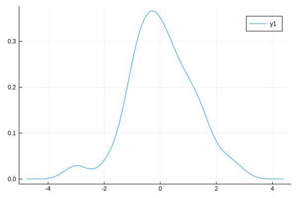

I've been staying home for a bit more than a week now. While keep working on my research, I also think it may help fill my time by picking up some skills. I've been following the development of Julia but haven't had the time to start learning it seriously, so this is the perfect time! As my first learning note, I've decided to try obtaining maximum likelihood estimates on some simulated data based on a one-factor model. I'm sure a lot of improvement can be made as this is really my first Julia notebook. But since to my knowledge there is currently no SEM packages in Julia, may be it could be a starting point. 

## Set Seed


```julia
using Random, Distributions
Random.seed!(123) # Setting the seed
```

## Generate Univarate Normal Data

Let's generate some normal data. In Julia the `Distribution.Normal` function can be used to set a `Normal` distribution. The `Base.rand` function will then generate data from that class. I was amazed that the `Distributions` package supported a wide range of distributions. 


```julia
d = Normal()
x = rand(d, 100)
```


    100-element Array{Float64,1}:
      1.1902678809862768
      2.04817970778924
      1.142650902867199
      0.45941562040708034
     -0.396679079295223
     -0.6647125451916877
      0.9809678267585334
     -0.07548306639775595
      0.27381537121215616
     -0.19422906710572047
     -0.33936602980781916
     -0.84387792144707
     -0.8889357468973064
      ⋮
     -0.7339610029444202
      0.45939803668120377
      1.7061863874321828
      0.6784427697934589
      0.28717953880710856
      1.0681555054109295
     -0.3068768981211787
     -1.9202140874350073
      1.6696020873668111
     -0.2135576214062456
     -0.16371133936712523
     -0.9029858060964956


```julia
using StatsPlots
density(x)
```





## Generate Multivariate Normal Data


```julia
d = MvNormal([1 0.5
              0.5 1])
```


    ZeroMeanFullNormal(
    dim: 2
    μ: [0.0, 0.0]
    Σ: [1.0 0.5; 0.5 1.0]
    )


```julia
x = rand(d, 1000)
```


    2×1000 Array{Float64,2}:
      0.173994   1.25713  -1.33584   …  1.22644   0.207192   0.254031
     -0.371218  -0.22681  -0.730016     0.944955  0.606183  -0.000434324


```julia
# Covariance matrix
using LinearAlgebra
cov(x')
```


    2×2 Array{Float64,2}:
     0.987069  0.473074
     0.473074  0.949026


The above shows how Julia can simulate multivariate normal data. Now, generate some cfa data


```julia
Λ = [.7
     .7
     .7
     .7]
Σ = Λ*Λ' + Diagonal(ones(4) * .51)
```


    4×4 Array{Float64,2}:
     1.0   0.49  0.49  0.49
     0.49  1.0   0.49  0.49
     0.49  0.49  1.0   0.49
     0.49  0.49  0.49  1.0


```julia
# Simulate data
y = rand(MvNormal(Σ), 100)
Sy = cov(y')
```


    4×4 Array{Float64,2}:
     0.846131  0.460656  0.418965  0.368367
     0.460656  0.942118  0.396868  0.405196
     0.418965  0.396868  0.98197   0.342197
     0.368367  0.405196  0.342197  0.902086


```julia
function loglik(θ, S = Sy)
    Λ = θ[1:4]
    Θ = Diagonal(θ[5:8])
    Σ = Λ*Λ' + Θ
    logdet(Σ) + tr(Σ\Sy)
end
```


    loglik (generic function with 2 methods)


```julia
# Try the function
loglik([.8, .7, .7, .7, .51, .51, .51, .51])
```


    2.8167873279580555


```julia
# Find maximum likelihood estimates
using Optim
@time optimize(loglik, [ones(4) * 0.7; ones(4) * 0.51], LBFGS())
```

      0.030934 seconds (24.63 k allocations: 1.637 MiB)


     * Status: success
    
     * Candidate solution
        Minimizer: [6.72e-01, 6.85e-01, 6.03e-01,  ...]
        Minimum:   2.748551e+00
    
     * Found with
        Algorithm:     L-BFGS
        Initial Point: [7.00e-01, 7.00e-01, 7.00e-01,  ...]
    
     * Convergence measures
        |x - x'|               = 7.06e-09 ≰ 0.0e+00
        |x - x'|/|x'|          = 1.03e-08 ≰ 0.0e+00
        |f(x) - f(x')|         = 1.33e-15 ≰ 0.0e+00
        |f(x) - f(x')|/|f(x')| = 4.85e-16 ≰ 0.0e+00
        |g(x)|                 = 7.33e-11 ≤ 1.0e-08
    
     * Work counters
        Seconds run:   0  (vs limit Inf)
        Iterations:    12
        f(x) calls:    33
        ∇f(x) calls:   33


```julia
# Use Hessians
using NLSolversBase, ForwardDiff
td = TwiceDifferentiable(loglik, [ones(4) * 0.7; ones(4) * 0.51]; autodiff = :forward)
@time opt = optimize(td, [ones(4) * 0.7; ones(4) * 0.51])
```

      0.540849 seconds (330.71 k allocations: 17.147 MiB, 2.58% gc time)


     * Status: success
    
     * Candidate solution
        Minimizer: [6.72e-01, 6.85e-01, 6.03e-01,  ...]
        Minimum:   2.748551e+00
    
     * Found with
        Algorithm:     Newton's Method
        Initial Point: [7.00e-01, 7.00e-01, 7.00e-01,  ...]
    
     * Convergence measures
        |x - x'|               = 2.33e-06 ≰ 0.0e+00
        |x - x'|/|x'|          = 3.40e-06 ≰ 0.0e+00
        |f(x) - f(x')|         = 2.45e-11 ≰ 0.0e+00
        |f(x) - f(x')|/|f(x')| = 8.92e-12 ≰ 0.0e+00
        |g(x)|                 = 1.20e-11 ≤ 1.0e-08
    
     * Work counters
        Seconds run:   0  (vs limit Inf)
        Iterations:    4
        f(x) calls:    12
        ∇f(x) calls:   12
        ∇²f(x) calls:  4


```julia
# Numerical Hessian
Optim.minimizer(opt)
@time ForwardDiff.hessian(loglik, Optim.minimizer(opt))
```

      0.026639 seconds (8.52 k allocations: 540.367 KiB)


    8×8 Array{Float64,2}:
      3.16649   -0.6156    -0.440022  …  -0.390832   -0.150853   -0.205811
     -0.6156     2.72063   -0.325774      1.09962    -0.174804   -0.124924
     -0.440022  -0.325774   2.24179      -0.260119    0.634179   -0.102112
     -0.38865   -0.380951  -0.237476     -0.184736   -0.101475    0.686983
      1.48048   -0.46019   -0.264316      0.333658    0.106909    0.198808
     -0.390832   1.09962   -0.260119  …   2.64123     0.144781    0.0711164
     -0.150853  -0.174804   0.634179      0.144781    1.94531     0.0498062
     -0.205811  -0.124924  -0.102112      0.0711164   0.0498062   2.25437


```julia
# Using NLSolverBase
@time hess = NLSolversBase.hessian!(td, Optim.minimizer(opt))
```

      0.000150 seconds (46 allocations: 80.734 KiB)


    8×8 Array{Float64,2}:
      3.16649   -0.6156    -0.440022  …  -0.390832   -0.150853   -0.205811
     -0.6156     2.72063   -0.325774      1.09962    -0.174804   -0.124924
     -0.440022  -0.325774   2.24179      -0.260119    0.634179   -0.102112
     -0.38865   -0.380951  -0.237476     -0.184736   -0.101475    0.686983
      1.48048   -0.46019   -0.264316      0.333658    0.106909    0.198808
     -0.390832   1.09962   -0.260119  …   2.64123     0.144781    0.0711164
     -0.150853  -0.174804   0.634179      0.144781    1.94531     0.0498062
     -0.205811  -0.124924  -0.102112      0.0711164   0.0498062   2.25437


```julia
# Asymptotic covariance matrix
diag(inv(hess) * 2 / 100)
```


    8-element Array{Float64,1}:
     0.008868570489264425
     0.009937870865887575
     0.010707718924937756
     0.009921369374706349
     0.00792975201139125
     0.009846163164104109
     0.011585717625197327
     0.00995946113518446


```julia

```
