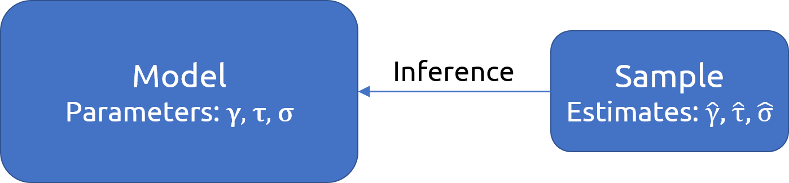

$$\newcommand{\bv}[1]{\boldsymbol{\mathbf{#1}}}$$

```{r setup, include=FALSE}
options(htmltools.dir.version = FALSE)
library(knitr)
opts_chunk$set(echo = TRUE, comment = ">#", fig.retina = 3)
hook_output <- knit_hooks$get("output")
knit_hooks$set(output = function(x, options) {
  lines <- options$output.lines
  if (is.null(lines)) {
    return(hook_output(x, options))  # pass to default hook
  }
  x <- unlist(strsplit(x, "\n"))
  more <- "..."
  if (length(lines)==1) {        # first n lines
    if (length(x) > lines) {
      # truncate the output, but add ....
      x <- c(head(x, lines), more)
    }
  } else {
    x <- c(more, x[lines], more)
  }
  # paste these lines together
  x <- paste(c(x, ""), collapse = "\n")
  hook_output(x, options)
})
```

```{r load-pkg, message=FALSE, echo=FALSE}
library(tidyverse)
library(lme4)
theme_set(theme_bw())
```

# Week Learning Objectives

- Describe conceptually what **likelihood function** and maximum likelihood estimation are

- Describe the differences between **maximum likelihood** and **restricted maximum likelihood**

- Conduct statistical tests for fixed effects

- Use the **likelihood ratio test** to test random slopes

- Report results of a multilevel analysis based on established guidelines

---

# Estimation

```{r img-model-sample, echo=FALSE, out.height='40%'}

```

Regression: OLS

MLM: Maximum likelihood, Bayesian

---
class: middle

# Why should I learn about estimation methods?

--

- ## Understand software options

--

- ## Know when to use better methods

--

- ## Needed for reporting

---
class: inverse, middle, center

# Maximum Likelihood Estimation

---

### The most commonly used methods in MLM are 
### maximum likelihood (ML) and restricted maximum likelihood (REML)

```{r sample-est, echo=FALSE, highlight.output=1}
(fm1 <- lmer(Reaction ~ Days + (Days | Subject), sleepstudy))
```

--

## But what is "Likelihood"?

---

# Likelihood 

.pull-left[
### Let’s say we want to estimate the population mean math achievement score $(\mu)$

We need to make some assumptions:

- Known *SD*: $\sigma = 8$

- The scores are normally distributed in the population

]

.pull-right[

```{r lik-pop, echo=FALSE, fig.width=3, fig.height=3, out.width='100%'}
ggplot(tibble(x = c(13 - 24, 13 + 24)), aes(x = x)) + 
  stat_function(fun = dnorm, args = list(mean = 13, sd = 8)) + 
  geom_vline(xintercept = 13, col = "red") + 
  labs(x = expression(mu), y = "") + 
  theme(axis.ticks = element_blank(), 
        axis.text = element_blank())
```

]

---

# Learning the Parameter From the Sample

Assume that we have scores from 5 representative students

```{r sam5, echo=FALSE}
sam5 <- tibble(Student = 1:5, 
               Score = c(23, 16, 5, 14, 7))
knitr::kable(sam5)
```

---

# Likelihood

If we **assume** that $\mu = 10$, how likely will we get 5 students with these scores?

.pull-left[
```{r lik-pop-10, echo=FALSE, out.width='90%', fig.width=3.5, fig.height=3.5}
ggplot(tibble(x = c(13 - 24, 13 + 24)), aes(x = x)) + 
  stat_function(fun = dnorm, args = list(mean = 10, sd = 8)) + 
  geom_point(data = sam5, aes(x = Score, 
                              y = dnorm(Score, mean = 10, sd = 8)), 
                size = 4, color = "blue") + 
  labs(x = expression(mu == 10), y = "") + 
  theme(axis.ticks = element_blank(), 
        axis.text = element_blank())
```
]

--

.pull-right[

```{r tab-lik-10, echo=FALSE}
mutate(sam5, 
       `$P(Y_i = y_i \\mid \\mu = 10)$` = 
         dnorm(Score, mean = 10, sd = 8)) %>% 
  knitr::kable()
```

Multiplying them all together:
$$P(Y_1 = 23, Y_2 = 16, Y_3 = 5, Y_4 = 14, Y_5 = 7 | \mu = 10)$$ 
= Product of the probabilities = 

```{r prod-10}
prod(dnorm(c(23, 16, 5, 14, 7), mean = 10, sd = 8))
```


]

---

# If $\mu = 13$

.pull-left[

```{r lik-pop-13, echo=FALSE, out.width='100%', fig.width=3.5, fig.height=3.5}
ggplot(tibble(x = c(13 - 24, 13 + 24)), aes(x = x)) + 
  stat_function(fun = dnorm, args = list(mean = 13, sd = 8)) + 
  geom_point(data = sam5, aes(x = Score, 
                              y = dnorm(Score, mean = 13, sd = 8)), 
                size = 4, color = "red") + 
  labs(x = expression(mu == 13), y = "") + 
  theme(axis.ticks = element_blank(), 
        axis.text = element_blank())
```

]

--

.pull-right[

```{r tab-lik-13, echo=FALSE}
mutate(sam5, 
       `$P(Y_i = y_i \\mid \\mu = 13)$` = 
         dnorm(Score, mean = 13, sd = 8)) %>% 
  knitr::kable()
```

Multiplying them all together:
$$P(Y_1 = 23, Y_2 = 16, Y_3 = 5, Y_4 = 14, Y_5 = 7 | \mu = 13)$$ 
= Product of the probabilities = 

```{r prod-13}
prod(dnorm(c(23, 16, 5, 14, 7), mean = 13, sd = 8))
```

]

---

Compute the likelihood for a range of $\mu$ values

.pull-left[

# Likelihood Function

```{r lik-func, echo=FALSE, out.width='90%', fig.height=3.5, fig.width=3.5}
lfun <- function(x) 
  prod(dnorm(x = c(23, 16, 5, 14, 7), mean = x, sd = 8))
# Vectorize
lfun <- Vectorize(lfun)
ggplot(tibble(mu = c(8, 18)), aes(x = mu)) + 
  geom_function(fun = lfun) + 
  geom_point(data = tibble(mu = c(10, 13)), 
             aes(x = mu, y = lfun(mu)), 
             col = "blue", size = 4) + 
  geom_segment(data = tibble(mu = c(10, 13)), 
               aes(x = mu, xend = mu, 
                   y = lfun(mu), yend = 0), 
               linetype = "dashed", col = "blue") + 
  labs(x = expression(mu), y = "Likelihood")
```

]

--

.pull-right[

# Log-Likelihood (LL) Function

```{r llik-func, echo=FALSE, out.width='90%', fig.width=3.5, fig.height=3.5}
llfun <- function(x) 
  sum(dnorm(x = c(23, 16, 5, 14, 7), mean = x, sd = 8, log = TRUE))
# Vectorize
llfun <- Vectorize(llfun)
ggplot(tibble(mu = c(8, 18)), aes(x = mu)) + 
  geom_function(fun = llfun) + 
  geom_point(data = tibble(mu = c(10, 13)), 
             aes(x = mu, y = llfun(mu)), 
             col = "blue", size = 4) + 
  geom_segment(data = tibble(mu = c(10, 13)), 
               aes(x = mu, xend = mu, 
                   y = llfun(mu), yend = -17.6), 
               linetype = "dashed", col = "blue") + 
  labs(x = expression(mu), y = "log(Likelihood)")
```

]

---

.pull-left[

# Maximum Likelihood

$\hat \mu = 13$ maximizes the (log) likelihood function

Maximum likelihood estimator (MLE)

]

--

.pull-right[

## Estimating $\sigma$

```{r llik-func-sigma, echo=FALSE, out.width='90%', fig.height=3.5, fig.width=3.5}
llfun <- function(x) 
  sum(dnorm(x = c(23, 16, 5, 14, 7), mean = 13, sd = x, log = TRUE))
# Vectorize
llfun <- Vectorize(llfun)
ggplot(tibble(sig = c(5, 10)), aes(x = sig)) + 
  geom_function(fun = llfun) + 
  geom_point(data = tibble(sig = c(6.5, 8)), 
             aes(x = sig, y = llfun(sig)), 
             col = "blue", size = 4) + 
  geom_segment(data = tibble(sig = c(6.5, 8)), 
               aes(x = sig, xend = sig, 
                   y = llfun(sig), yend = -17.6), 
               linetype = "dashed", col = "blue") + 
  labs(x = expression(sigma), y = "log(Likelihood)")
```

]

---

# Curvature and Standard Errors

.pull-left[

$N = 5$

```{r mle-ase1, echo=FALSE, warning=FALSE, fig.width=3.5, fig.height=3.5, out.width='90%'}
llfun <- function(x) 
  sum(dnorm(x = c(23, 16, 5, 14, 7), mean = x, sd = 8, log = TRUE))
# Vectorize
llfun <- Vectorize(llfun)
ggplot(tibble(mu = c(8, 18)), aes(x = mu)) + 
  geom_function(fun = llfun) + 
  ylim(-17.5, -16.5) + 
  labs(x = expression(mu), y = "log-likelihood")
```

]

.pull-right[

$N = 20$

```{r mle-ase2, echo=FALSE, warning=FALSE, fig.width=3.5, fig.height=3.5, out.width='90%'}
llfun <- function(x) 
  sum(dnorm(x = rep(c(23, 16, 5, 14, 7), 4), 
            mean = x, sd = 8, log = TRUE))
# Vectorize
llfun <- Vectorize(llfun)
ggplot(tibble(mu = c(8, 18)), aes(x = mu)) + 
  geom_function(fun = llfun) + 
  ylim(-67.5, -66.5) + 
  labs(x = expression(mu), y = "log-likelihood")
```

]


---
class: inverse, center, middle

# Estimation Methods for MLM

---

# For MLM

Find $\gamma$s, $\tau$s, and $\sigma$ that maximizes the likelihood function

$$\ell(\bv \gamma, \bv \tau, \sigma; \bv y) = - \frac{1}{2} \left\{\log | \bv V(\bv \tau, \sigma)| + (\bv y - \bv X \bv \gamma)^\top \bv V^{-1}(\bv \tau, \sigma) (\bv y - \bv X \bv \gamma) \right\} + K$$

Here's the log-likelihood function for the coefficient of `meanses` (see code in the provided Rmd):

```{r m_lv2, message=FALSE, echo=FALSE}
library(haven)
library(here)
library(lme4)
# Read in the data (pay attention to the directory)
hsball <- read_sav(here("data_files", "hsball.sav"))
m_lv2 <- lmer(mathach ~ meanses + (1 | id), data = hsball)
```

.pull-left[

```{r loglik-meanses, echo=FALSE, fig.height=4, fig.width=5.5}
# Extract V from the model
V_m_lv2 <- (crossprod(getME(m_lv2, "A")) + Matrix::Diagonal(7185)) *
  sigma(m_lv2)^2
# Log-likelihood function with respect to gamma01
llfun <- function(gamma01, 
                  gamma00 = fixef(m_lv2)[1], 
                  y = m_lv2@resp$y, 
                  X = cbind(1, m_lv2@frame$meanses), 
                  V = V_m_lv2) {
  gamma <- c(gamma00, gamma01)
  y_minus_Xgamma <- y - X %*% gamma
  N <- length(y)
  as.numeric(
   - (N * log(2 * pi) + determinant(V)$modulus + crossprod(y_minus_Xgamma, solve(V, y_minus_Xgamma))) / 2
  )
}
# Vectorize
llfun <- Vectorize(llfun)
# Plot
ggplot(tibble(gamma01 = c(5, 7)), aes(x = gamma01)) + 
  stat_function(fun = llfun) + 
  labs(x = expression(gamma[0][1]), y = "log(likelihood)")
```

]

.pull-right[

```{r deviance-gamma01, echo=FALSE, fig.height=4, fig.width=5.5}
# Plot
ggplot(tibble(gamma01 = c(5, 7)), aes(x = gamma01)) + 
  stat_function(fun = function(x) llfun(x) * -2) + 
  labs(x = expression(gamma[0][1]), y = "Deviance")
```

]

---

# Numerical Algorithms

.pull-left[

```{r m_lv2-verbose}
m_lv2 <- lmer(mathach ~ meanses + (1 | id), data = hsball, verbose = 1)
```

]

.pull-right[

```{r deviance-gamma01-2, echo=FALSE, fig.height=4, fig.width=5.5}
# Plot
ggplot(tibble(gamma01 = c(5, 7)), aes(x = gamma01)) + 
  stat_function(fun = function(x) llfun(x) * -2) + 
  labs(x = expression(gamma[0][1]), y = "Deviance")
```

]

---

# ML vs. REML

REML has corrected degrees of freedom for the variance component estimates (like dividing by $N - 1$ instead of by $N$ in estimating variance)

- REML is generally preferred in smaller samples

- The difference is small with large number of clusters

Technically, REML only estimates the variance components<sup>1</sup>

.footnote[

[1] The fixed effects are integrated out and are not part of the likelihood function. They are solved in a second step, usually by the generalized least squares (GLS) method

]

---

.pull-left[

### 160 Schools

```{r table-ml-reml, echo=FALSE, message=FALSE}
library(broom.mixed)
m_lv2 <- lmer(mathach ~ meanses + (1 | id), data = hsball)
m_lv2ml <- refitML(m_lv2)
modelsummary::msummary(list("REML" = m_lv2, 
                            "ML" = m_lv2ml))
```

]

--

.pull-right[

### 16 Schools

```{r hsbsub, include=FALSE}
# Randomly select 16 school ids
set.seed(840)  # use the same seed so that the same 16 schools are selected
random_ids <- sample(unique(hsball$id), size = 16)
hsbsub <- hsball %>%
    filter(id %in% random_ids)
m_lv2_sub <- update(m_lv2, data = hsbsub)
m_lv2ml_sub <- refitML(m_lv2_sub)
```

```{r table-ml-reml-sub, echo=FALSE, message=FALSE}
modelsummary::msummary(list("REML" = m_lv2_sub, 
                            "ML" = m_lv2ml_sub))
```

]

---

# Other Estimation Methods

### Generalized estimating equations (GEE)

- Robust to some misspecification and non-normality
- Maybe inefficient in small samples (i.e., with lower power)
- See Snijders & Bosker 12.2; the `geepack` R package

### Markov Chain Monte Carlo (MCMC)/Bayesian

---
class: inverse, middle, center

# Testing

---

### Fixed effects $(\gamma)$

- Usually the likelihood-based CI/likelihood-ratio (LRT; $\chi^2$) test is sufficient
- Small sample (10--50 clusters): Kenward-Roger approximation of degrees of freedom
- Non-normality: Residual bootstrap<sup>1</sup>
    
### Random effects $(\tau)$

- LRT (with $p$ values divided by 2)

.footnote[

[1]: See [van der Leeden et al. (2008)](https://link-springer-com.libproxy1.usc.edu/chapter/10.1007/978-0-387-73186-5_11) and [Lai (2020)](https://doi.org/10.1080/00273171.2020.1746902) 

]

---

# Likelihood Ratio (Deviance) Test

$$H_0: \gamma = 0$$
--

Likelihood ratio: $\dfrac{L(\gamma = 0)}{L(\gamma = \hat \gamma)}$

Deviance: $-2 \times \log\left(\frac{L(\gamma = 0)}{L(\gamma = \hat \gamma)}\right)$  
= $-2 \mathrm{LL}(\gamma = 0) - [-2 \mathrm{LL}(\gamma = \hat \gamma)]$  
= $\mathrm{Deviance} \mid_{\gamma = 0} - \mathrm{Deviance} \mid_{\gamma = \hat \gamma}$

ML (instead of REML) should be used

---

# Example

```{r ran_int, echo=FALSE, output.lines=c(1:2, 4:5)}
(ran_int <- lmer(mathach ~ (1 | id), data = hsball, REML = FALSE))
```

```{r print-m_lv2, echo=FALSE, output.lines=c(1:2, 4:5)}
refitML(m_lv2)
```

```{r}
pchisq(47115.81 - 46959.11, df = 1, lower.tail = FALSE)
```


In `lme4`, use 

```{r drop1-m_lv2, results='hide'}
drop1(m_lv2, test = "Chisq")  # Automatically use ML
```

---

# $F$ Test With Small-Sample Correction

### Needs approximation of degrees of freedom (*df*)

Kenward-Roger approximation generally performs well with < 50 clusters

```{r anova-crlv_int, message=FALSE}
library(lmerTest)
m_contextual <- lmer(mathach ~ meanses + ses + (1 | id), 
                     data = hsbsub)
anova(m_contextual, ddf = "Kenward-Roger")
```

---

# LRT for Random Slopes

.pull-left[

### Should you include random slopes?

Theoretically yes unless you're certain that the slopes are the same for every groups

However, frequentist methods usually crash with more than two random slopes

- Test the random slopes one by one, and identify which one is needed
- Bayesian methods are more equipped for complex models

]

--

.pull-right[

### "One-tailed" LRT

LRT $(\chi^2)$ is generally a two-tailed test. But for random slopes, 

$H_0: \tau_1 = 0$ is a one-tailed hypothesis

A quick solution is to divide the resulting $p$ by 2<sup>1</sup>

.footnote[

[1]: Originally proposed by Snijders & Bosker; tested in simulation by LaHuis & Ferguson (2009, https://doi.org/10.1177/1094428107308984)

]

]

---

# Example: LRT for $\tau^2_1$

```{r centering, echo=FALSE}
hsball <- hsball %>% 
  group_by(id) %>%   # operate within schools
  mutate(ses_cm = mean(ses),   # create cluster means (the same as `meanses`)
         ses_cmc = ses - ses_cm) %>%   # cluster-mean centered
  ungroup()  # exit the "editing within groups" mode
```

.pull-left[

```{r ran_slp, echo=FALSE, output.lines=2:4}
(ran_slp <- lmer(mathach ~ meanses + ses_cmc + (ses_cmc | id), data = hsball))
```

```{r m_bw, echo=FALSE, output.lines=2:4}
(m_bw <- lmer(mathach ~ meanses + ses_cmc + (1 | id), data = hsball))
```

]

--

.pull-right[

.center[

### G Matrix

$$\begin{bmatrix}
     \tau^2_0 &  \\
     \tau_{01} & \tau^2_1 \\
  \end{bmatrix}$$

$$\begin{bmatrix}
     \tau^2_0 & \\
     {\color{red}0} & {\color{red}0} \\
  \end{bmatrix}$$
  
]

]

--

```{r}
pchisq(10.92681, df = 2, lower.tail = FALSE)
```

Need to divide by 2

---
class: inverse, middle, center

# Reporting

## McCoach (2019 chapter), see HW 5

